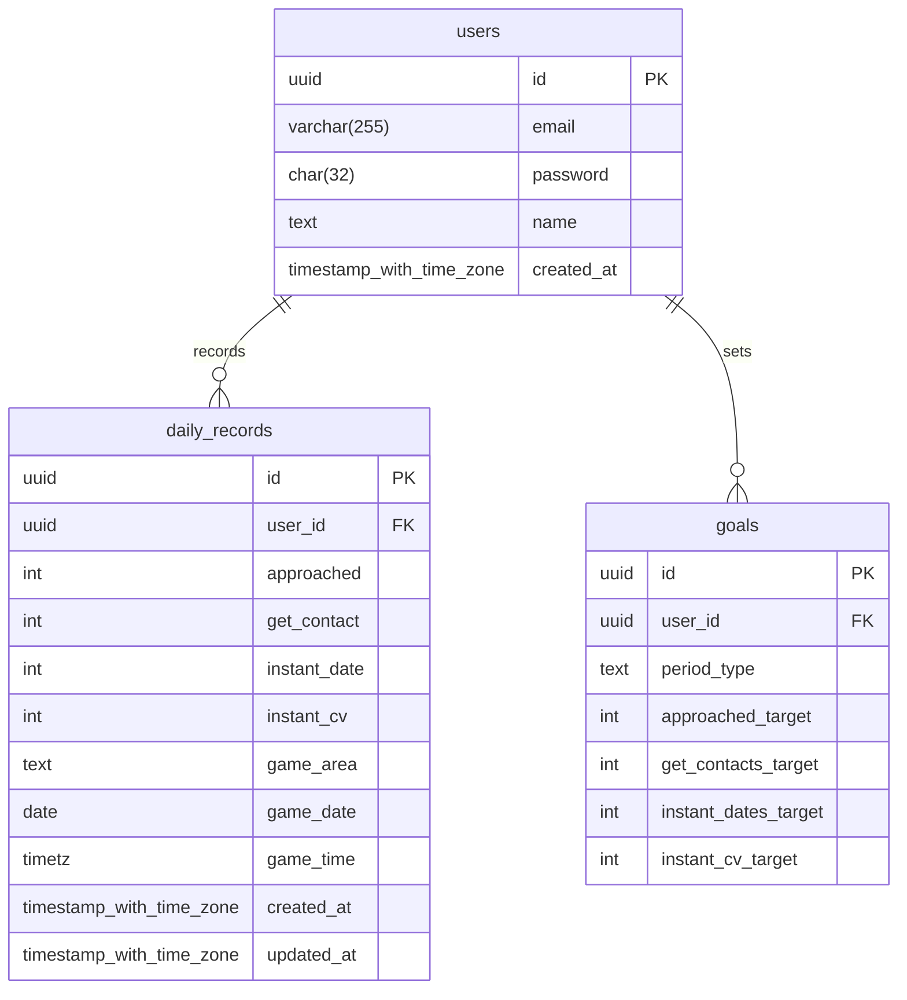

```mermaid
erDiagram
    users ||--o{ daily_records : records
    users ||--o{ goals : sets
    users {
        uuid id PK
        varchar(255) email
        char(32) password
        text name
        timestamp_with_time_zone created_at
    }
    daily_records {
        uuid id PK
        uuid user_id FK
        int approached
        int get_contact
        int instant_date
        int instant_cv
        text game_area
        date game_date
        timetz game_time
        timestamp_with_time_zone created_at
        timestamp_with_time_zone updated_at
    }
    goals {
        uuid id PK
        uuid user_id FK
        text period_type
        int approached_target
        int get_contacts_target
        int instant_dates_target
        int instant_cv_target
    }
```
